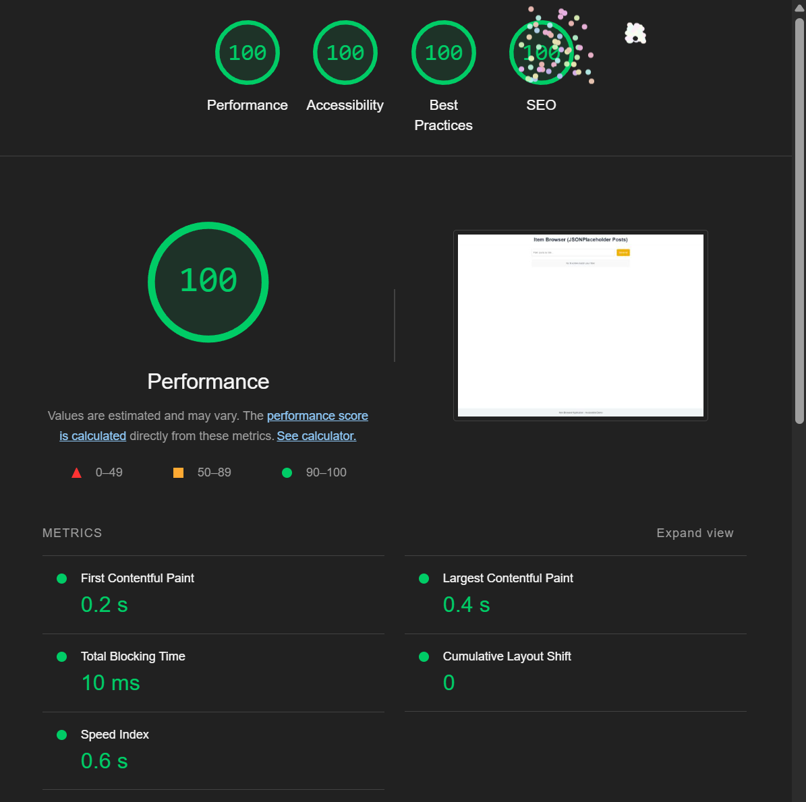

## Next.js Post Explorer Application

This repository contains a Next.js application that demonstrates efficient data fetching, handling, and display strategies with the JSONPlaceholder API. The application features a responsive post list with search functionality, detailed post views, and several performance optimizations.

---

## Setup Instructions

To run this project locally, follow these steps:

### Clone the repository

```bash
git clone https://github.com/boneyrox/mkit-list-app.git
cd mkit-list-app
```

### Install dependencies

Using npm:

```bash
npm install
```

Using Yarn:

```bash
yarn install
```

Using pnpm:

```bash
pnpm install
```

### Start the development server

Using npm:

```bash
npm run dev
```

Using Yarn:

```bash
yarn dev
```

Using pnpm:

```bash
pnpm dev
```

---

## API Choice

I used the [JSONPlaceholder API](https://jsonplaceholder.typicode.com/posts) for this project because it provides simple mock data that's perfect for fast-paced development and demonstration purposes.

---

## Data Fetching Justifications

- **List Page**: I chose `getStaticProps` because the list of posts doesn't change often, so generating it at build time makes sense for performance and SEO benefits.
- **Detail Page**: I used `getStaticPaths` with `fallback: 'blocking'` to pre-generate the first 100 posts at build time (most commonly viewed) while allowing other posts to be generated on demand. This approach balances performance with flexibility.

---

## Assumptions/Challenges

- I assumed the JSONPlaceholder API would remain stable and that users would typically view posts with lower IDs more frequently.
- Learning about Next.js data fetching strategies was a valuable experience, particularly understanding when to use static generation with fallback vs. server-side rendering.
- Making the app fully accessible was challenging but rewarding - especially fixing issues flagged by Lighthouse.
- Error handling for various cases (invalid IDs, API failures, missing data) took careful planning to keep the UX smooth.
- I focused on applying the DRY (Don't Repeat Yourself) principle throughout the codebase to improve maintainability.

---

## Performance

Here's the Lighthouse score for the application:



**Lighthouse Score: 100/100**

- Performance
- Accessibility
- Best Practices
- SEO

---

## Bonus Features

- Search functionality to filter posts by title and content
- Favorites feature using localStorage to persist selections
- Responsive design for mobile, tablet, and desktop
- Full keyboard accessibility
- Improved error handling with custom error states

---

## Discussion Questions

### a) Frequent Data Updates

For frequently updated data, I'd switch to Incremental Static Regeneration with a short revalidation period (maybe 60 seconds). This would still give us the performance benefits of static generation while ensuring reasonably fresh data. Users would always get a fast response while the content refreshes in the background, striking a good balance between speed and freshness.

### b) Rendering Performance

If the list grew to hundreds of items, potential bottlenecks would include re-rendering the entire list when only a single item changes. I'd implement `React.memo` for the list items to prevent unnecessary re-renders and use pagination or infinite scrolling rather than trying to render all items at once. I might also consider using `useMemo` to memoize filtered results so they don't recalculate on every render.

### c) Custom Hook Usage

I created custom hooks like `usePostFiltering` to handle search and filtering logic and `useFavorites` for managing favorite posts. This kept the main component cleaner and made the code more maintainable. The biggest benefit was separating concerns - the components focused on rendering while the hooks handled data manipulation. It also made the code more testable and potentially reusable if we added more features.

### d) State Management Trade-offs

I didn't use Context API for favorites - just plain localStorage with a custom hook for simplicity. In a larger app, this approach might not scale well since it lacks features like automatic state synchronization across tabs. A better alternative might be Redux or Zustand, which would give us better dev tools, more structured updates, and better performance for complex state, though at the cost of adding complexity.

### e) Next.js Page Lifecycle

For the List Page, data fetching happens at build time via `getStaticProps`, creating static HTML that's immediately sent to the client. For the Detail Page, common posts (IDs 1-100) are generated at build time, while others are generated on-demand when requested. In both cases, the server handles data fetching and initial rendering, then the client hydrates the page to make it interactive. This hybrid approach gives us both good performance and flexibility.

---

## Deployment

The app is deployed at: [https://mkit-list-app.vercel.app](https://mkit-list-app.vercel.app)
